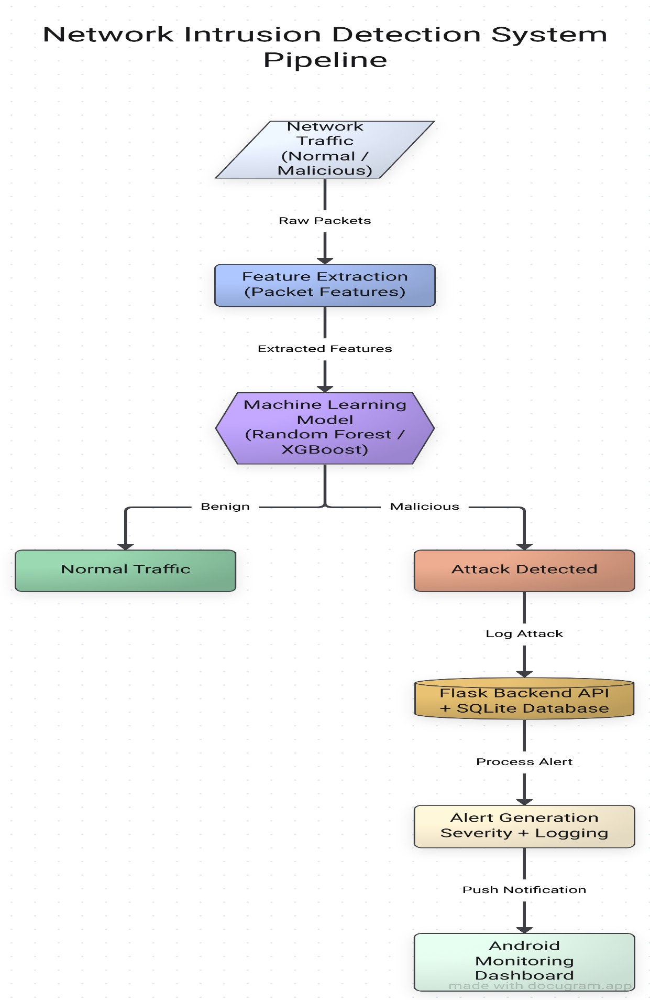
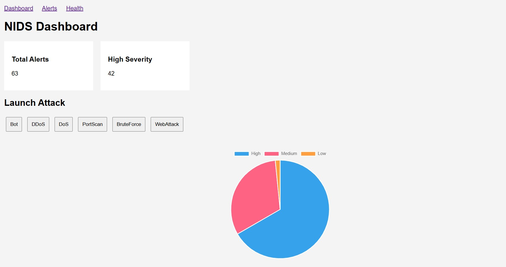
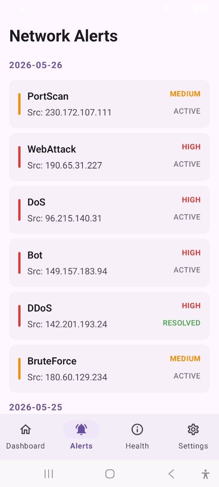
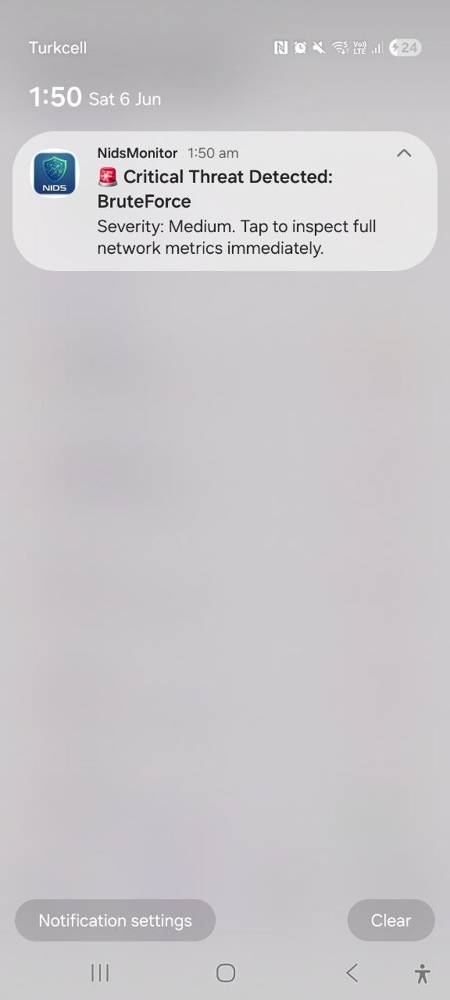

# 🛡️ NIDS — Network Intrusion Detection System

> A real-time Network Intrusion Detection System that uses Machine Learning to classify network traffic and pushes instant attack alerts to a companion Android app.

[](https://www.python.org/)
[](https://flask.palletsprojects.com/)
[](https://xgboost.readthedocs.io/)
[](https://developer.android.com/jetpack/compose)
[](LICENSE)

🎓 Senior Project Thesis — Karabük University, Department of Computer Engineering

---

## 📌 Overview

This project detects network intrusions in real time using a machine learning model trained on the **CICIDS2017** dataset, and delivers instant push alerts to an Android app whenever an attack is classified. It's a full end-to-end system: **ML pipeline → Flask REST API → live web dashboard → mobile monitoring app**.

**Attack types detected:** BENIGN, DDoS, DoS, PortScan, Brute Force, Web Attack, Botnet.

### 🎯 Key Results

| Metric | Score |
|---|---|
| Accuracy (XGBoost) | **99.93%** |
| Macro Recall | **99.98%** |
| ROC-AUC | **1.0000** |
| Test set size | 565,566 samples |

Four models were benchmarked (Random Forest, XGBoost, LightGBM, SVM); **XGBoost was selected for deployment** due to its highest recall on attack classes — critical in security applications where a missed attack is far more costly than a false alarm.

## 🏗️ System Architecture

<p align="center">
  
</p>


## ✨ Features

- 🧠 **ML Classification** — XGBoost model trained on 52 engineered features from CICIDS2017, detecting 7 traffic classes
- ⚡ **Real-Time Backend** — Flask REST API with SQLite logging, severity scoring, and simulated live traffic ingestion
- 📊 **Web Dashboard** — live alert stats, severity distribution chart, alert log, and system health monitor
- 📱 **Android App** — Kotlin + Jetpack Compose app with MVVM architecture, live polling, and deep-linked push notifications via Firebase Cloud Messaging
- 🔔 **Instant Alerts** — attack detected → logged → pushed to mobile in real time, with tap-to-view alert details

## 🖥️ Screenshots

| Web Dashboard | Android Alerts | Mobile Push Alert |
|---|---|---|
|  |  |  |


## 🏛️ Repository Structure

📂 ml-training/     — data preprocessing, model training & evaluation notebooks  
📂 backend/         — Flask REST API + ML inference + SQLite + FCM integration  
📂 mobile-app/      — Android app (Kotlin, Jetpack Compose)  
📂 docs/            — architecture diagrams & screenshots  

## ⚙️ Getting Started

### 1. Backend (Flask + ML API)

```bash
cd backend
python -m venv venv
source venv/bin/activate      # Windows: venv\Scripts\activate
pip install -r requirements.txt
python app.py
```
Server runs at `http://localhost:5000`. You'll need a Firebase `serviceAccountKey.json` in `backend/` for push notifications to work (see Firebase setup below).

### 2. ML Training (optional — pretrained models included)

```bash
cd ml-training
pip install -r requirements.txt
jupyter notebook notebooks/nids_training.ipynb
```
Download the [CICIDS2017 dataset](https://www.unb.ca/cic/datasets/ids-2017.html) and place CSVs in `ml-training/data/raw/` — see `ml-training/data/README.md`.

### 3. Android App

1. Open `mobile-app/NidsMonitor` in Android Studio
2. Add your own `google-services.json` from Firebase Console
3. In **Settings**, point the app to your backend's IP: `http://<your-ip>:5000/`
4. Run on an emulator or physical device on the same local network

## 🔌 API Endpoints

| Endpoint | Method | Description |
|---|---|---|
| `/api/simulate/<class_id>` | GET | Runs ML inference on a sample, logs alert, sends FCM push |
| `/api/alerts` | GET | Returns all alert records |
| `/api/stats` | GET | Returns aggregate severity counts |
| `/api/health` | GET | Real-time system metrics (CPU, memory, network) |
| `/api/resolve/<id>` | GET | Marks an alert as resolved |

## 🧠 Machine Learning Pipeline

1. **Data Consolidation** — merged 8 CICIDS2017 CSVs into one dataframe
2. **Cleaning** — removed NaN/Inf rows from flow-rate calculations
3. **Label Consolidation** — 15 sub-labels → 7 broad classes
4. **Feature Reduction** — 84 → 52 features (removed metadata, zero-variance, and highly correlated features)
5. **Train/Test Split** — stratified 80/20 split, `StandardScaler` fit on train only

| Model | Accuracy | F1 (macro) | Recall (macro) | ROC-AUC |
|---|---|---|---|---|
| Random Forest | 99.96% | 99.96% | 98.84% | 1.0000 |
| **XGBoost (deployed)** | **99.93%** | **99.93%** | **99.98%** | **1.0000** |
| LightGBM | 99.29% | 99.30% | 85.68% | 0.9915 |
| SVM (binary) | 92.99% | 93.02% | 89.26% | 0.9754 |

## 🛠️ Tech Stack

**ML/Backend:** Python, XGBoost, scikit-learn, pandas, NumPy, Flask, SQLite, Firebase Admin SDK, psutil
**Mobile:** Kotlin, Jetpack Compose (Material3), Retrofit2, Gson, Firebase Cloud Messaging
**Dataset:** [CICIDS2017](https://www.unb.ca/cic/datasets/ids-2017.html) (Canadian Institute for Cybersecurity)

## ⚠️ Limitations & Future Work

- Currently simulates traffic by sampling the dataset rather than capturing live packets — real packet capture via Scapy/CICFlowMeter is the next step
- Single-server deployment with no load balancing
- Local network only — cloud deployment would enable remote monitoring
- See full discussion in the [thesis document](docs/thesis.pdf)

## 📄 License

MIT License — see [LICENSE](LICENSE) for details.

## 👤 Author

**Zaw Naing**
Computer Engineering, Karabük University
📧 zawnaingtr@gmail.com

*Senior Project Thesis, supervised by Asst. Prof. Dr. Bilal Yousfi*